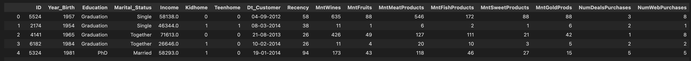
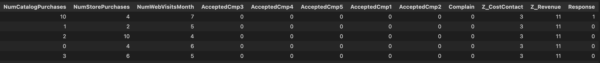
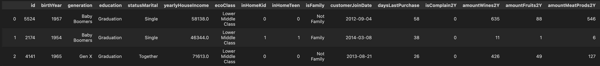
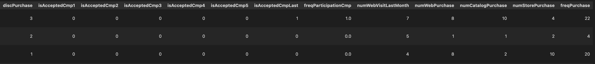

# **README**
Please, read this before before you continue to read / run the Jupyter Notebook file.

This notebook is created as a second capstone project for me to participate in Data Science course in Purwadhika. The notebook is about doing end-to-end analysis of certain dataset. So this is my portfolio to work on my learning journey towards data science. This analysis might have some flaws, but i tried my best. ;D

The dataset used here is a Supermarket Marketing Campaign data. It's attached in this repo or you can also download it through Kaggle [here](https://www.kaggle.com/datasets/rodsaldanha/arketing-campaign) for recent file version.

You can see the Tableau Visualization [here](https://public.tableau.com/app/profile/diki.renanda/viz/SupermarketCampaign-CapstoneProjMod2-DikiRenanda/SupermarketCampaignAnalysisbyDikiRenanda?publish=yes)

You can see the Presentation version [here](https://www.canva.com/design/DAFlcOWdrRM/4AriDlVwh6SJCz04kBViwg/view?utm_content=DAFlcOWdrRM&utm_campaign=designshare&utm_medium=link&utm_source=publishsharelink)

---

## **What i do in the Analysis?**
**PW Mart**, a fictional Supermarket it US that sells many products ranging from meats, fishs, fruits, sweets, liquors, even golds. People can come through an offline store, web store, or catalog store.

They also have membership for their customers. This way, they can record some personal data of customers. Over the last year, PW Mart held a series of campaign. They already run the campaign 6 times.

They hire a Data Analyst to help them analyze the data they already gather for the last 2 years and design the base of their next campaign.

PW Mart Marketing / Campaign Team has already run 6 campaigns over the last year and ready to design 7th campaign.

---

## **Problems**
- Autopilot campaign
- Seems not working well
- Only catch small size of participant

## **Objective**
- Formulate the 7th campaign by doing internal analysis based on internal data

## **How?**
1. Based on experience, evaluate campaign participations!
2. Based on demographics, what's the best target audience?
3. Based on experience, is discount needed?
    - If needed, which products that should be discounted?
4. What channel of purchase should we integrate more in the campaign?

---

## **Dataset**
Let's take a look into our dataset.  
This is the version before data cleansing.

Here are what i do in data cleansing:
1. Renaming the columns (for easier understanding and navigation)
2. Change data format to what it's supposed to.
3. Check and fill missing values.
4. Add new columns for data demographic grouping
5. Add new columns for sum values
6. Drop unnecessary columns

This is the version after data cleansing:

## **Glossary**

After renaming the columns, here's a dictionary for you to take notes:
**PEOPLE**
- **id:** Customer's unique identifier
- **birthYear:** Customer's birth year
- **education:** Customer's education level
- **statusMarital:** Customer's marital status
- **yearlyHouseIncome:** Customer's yearly household income
- **inHomeKid:** Number of children in customer's household
- **inHomeTeen:** Number of teenagers in customer's household
- **customerJoinDate:** Date of customer's enrollment with the company
- **daysLastPurchase:** Number of days since customer's last purchase
- **isComplain2Y:** 1 if the customer complained in the last 2 years, 0 otherwise

**PRODUCT**
- **amountWines2Y:** Amount spent on wine in last 2 years
- **amountFruits2Y:** Amount spent on fruits in last 2 years
- **amountMeatProds2Y:** Amount spent on meat in last 2 years
- **amountFishProds2Y:** Amount spent on fish in last 2 years
- **amountSweetProds2Y:** Amount spent on sweets in last 2 years
- **amountGoldProds2Y:** Amount spent on gold in last 2 years

**PROMOTION**
- **discPurchase:** Number of purchases made with a discount
- **isAcceptedCmp1:** 1 if the customer accepted the offer in the 1st campaign, 0 otherwise
- **isAcceptedCmp2:** 1 if the customer accepted the offer in the 2nd campaign, 0 otherwise
- **isAcceptedCmp3:** 1 if the customer accepted the offer in the 3rd campaign, 0 otherwise
- **isAcceptedCmp4:** 1 if the customer accepted the offer in the 4th campaign, 0 otherwise
- **isAcceptedCmp5:** 1 if the customer accepted the offer in the 5th campaign, 0 otherwise
- **isAcceptedCmpLast:** 1 if the customer accepted the offer in the last campaign, 0 otherwise

**PLACE**
- **numWebPurchase:** Number of purchases made through the company’s website
- **numCatalogPurchase:** Number of purchases made using a catalog
- **numStorePurchase:** Number of purchases made directly in stores
- **numWebVisitsMonth:** Number of visits to the company’s website in the last month

---

## **Analysis**
Basically what i analyze here is answering the 'how' to achieve the objective.

I evaluate how the participation in each campaign and overall. I calculate:
1. Proportion of the participation per demography
2. Proportion of participation in whole campaigns
3. Rate of participation per demography
4. Rate of participation in whole campaigns
5. Proportion of population per demography
6. Correlation test to find what works best to solve the problems
7. Discount analysis per demography and overall
8. Channel of purchase per demography and overall

---

To make your notebook reading more contextual, here are my overall findings to take notes.

## **Evaluation**
Campaign was more focused on:
- Generation: Millennials
- Education: PhD
- Marital: Single
- Economic Class: Lower Middle Class
- Family: Not Family
- 2nd and 6th campaign has same pattern

Based on discount and channel of purchase:
- Almost everyone has bought in discount but the rate of purchase is quite small (1 out of 5 purchases).
- Almost everyone has ever bought from Store and Web.
- All favored Store as main channel of purchase

## **Conclusion**
Highest Population:
- Lower Middle Class (75%)
- Family (72%)
- Couple - Married (39%) and Together (26%) = (65%)
- Graduation (50%)
- Gen X (48%)

Based on discount and channel of purchase:
- Discount is a good tool to attract participants but should meet needs of top demography.
- Store is the best channel of purchase followed by Web.

## **Recommendation**
1. **Aim for higher population.** (based on correlation test)

Priority to aim:
- Lower Middle Class (75%)
- Family (72%)
- Couple - Married (39%) and Together (26%) = (65%)
- Graduation (50%)
- Gen X (48%)

2. Integrates discount to campaign with items that meet the needs of top demography.
3.  Boost campaign in Store.
If budget is good, also boost on Web

---

###### **This notebook is created by Diki Renanda / @dikisahkan. You can reach me through any social media GitHub, Medium, LinkedIn, IG, and TikTok.**